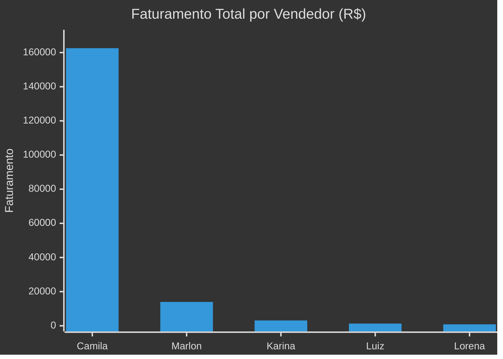

# 📊 Relatorio Geral de Desempenho - Unidade Porto Velho
**Periodo:** Ultimos 30 dias (28/03/2026 - 27/04/2026)

---

## 🥇 Top Performance (Ranking Financeiro)
| Consultor | Total Ganho (R$) | Leads Ganhos | Leads Perdidos | Ticket Medio |
| :--- | :--- | :---: | :---: | :--- |
| Camila Oliveira | R$ 162,569.00 | 23 | 332 | R$ 7,068.22 |
| MARLON BARBA | R$ 13,982.00 | 3 | 3 | R$ 4,660.67 |
| Karina Azevedo | R$ 3,135.00 | 79 | 148 | R$ 39.68 |
| Luiz Gonzaga | R$ 1,300.00 | 1 | 0 | R$ 1,300.00 |
| LORENA | R$ 853.00 | 16 | 49 | R$ 53.31 |
| Erica Caitano | R$ 0.00 | 0 | 0 | R$ 0.00 |
| Crislane Azevedo | R$ 0.00 | 0 | 0 | R$ 0.00 |
| Helen Tayane | R$ 0.00 | 2 | 0 | R$ 0.00 |

---

## 📈 Quem mais trabalha no CRM (Leads Movimentados no Mes)
| Consultor | Atividade (Qtd Leads) | % do Total |
| :--- | :---: | :---: |
| Camila Oliveira | 455 | 26.4% |
| Karina Azevedo | 360 | 20.9% |
| Helen Tayane | 231 | 13.4% |
| MARLON BARBA | 214 | 12.4% |
| Erica Caitano | 185 | 10.7% |
| LORENA | 101 | 5.9% |
| Luiz Gonzaga | 8 | 0.5% |
| Crislane Azevedo | 1 | 0.1% |

---

## 📝 Disciplina e Saude do Funil (Tarefas)
| Consultor | Tarefas Abertas | Tarefas Atrasadas | Status |
| :--- | :---: | :---: | :--- |
| Erica Caitano | 0 | 0 | ✅ ELITE |
| LORENA | 0 | 0 | ✅ ELITE |
| Crislane Azevedo | 0 | 0 | ✅ ELITE |
| Camila Oliveira | 1 | 0 | ✅ ELITE |
| Luiz Gonzaga | 3 | 2 | ⚠️ REQUER ATENCAO |
| MARLON BARBA | 17 | 16 | ⚠️ REQUER ATENCAO |
| Karina Azevedo | 21 | 18 | ⚠️ REQUER ATENCAO |
| Helen Tayane | 25 | 24 | ⚠️ REQUER ATENCAO |

---

## 🏷️ Volumetria de Tags por Responsavel (Segmentacao)
| Consultor | Total de Tags Vinculadas |
| :--- | :---: |
| Camila Oliveira | 872 |
| Erica Caitano | 539 |
| Karina Azevedo | 467 |
| MARLON BARBA | 362 |
| Helen Tayane | 327 |
| LORENA | 169 |
| Luiz Gonzaga | 3 |
| Crislane Azevedo | 1 |

---

## 💡 Insights Gerais da Unidade
1. **Concentracao de Faturamento:** A Camila Oliveira e a principal responsavel pelo faturamento da unidade no periodo.
2. **Gargalo Operacional:** Ha um volume consideravel de tarefas atrasadas concentradas em 3 vendedores, o que pode estar impedindo o aumento do faturamento total.
3. **Cultura de Dados:** O alto volume de tags da Camila e do Marlon indica uma base mais rica em informacoes, facilitando o remarketing e a segmentacao.
