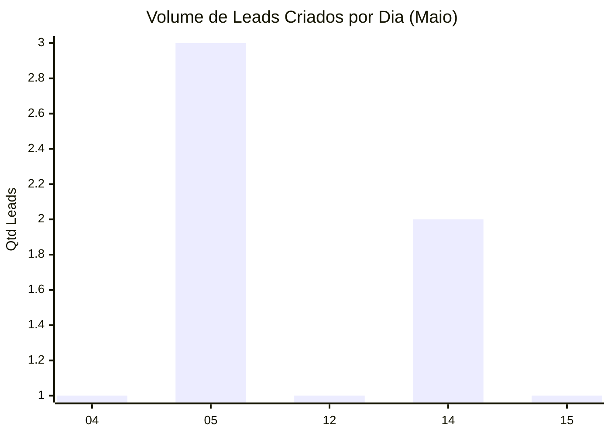

# Relatório de Desempenho - Luiz Gonzaga
**Data de Geração:** 18/05/2026 15:05
**Período:** 01/05/2026 a 18/05/2026

## 💰 Resultados de Vendas
- **Total Vendido:** R$ 0,00
- **Leads Ganhos:** 0
- **Leads Perdidos:** 0
- **Taxa de Conversão (Win Rate):** 0.0%

## 📋 Gestão de Leads
- **Leads sob Responsabilidade (Atuais):** 17
- **Total de Leads Criados no Mês:** 8

## ❌ Análise de Perdas
**Motivos das oportunidades perdidas:**
- Nenhum motivo registrado no período.

## 🛠️ Atividades e Tarefas
- ✅ **Concluídas (no mês):** 0
- ⏳ **Pendentes:** 9
- 🚨 **Atrasadas:** 8

## 🏷️ Tags nos Ganhos
**Principais tags nos leads convertidos:**
- Nenhuma tag identificada nos ganhos.

## 📈 Volume de Leads Criados por Dia

---
[[Dashboard_Inicial|⬅️ Voltar ao Dashboard]]
